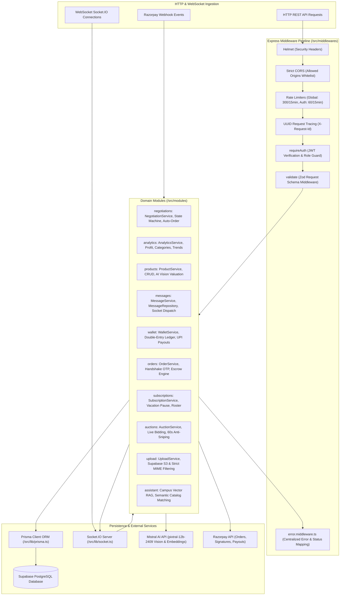
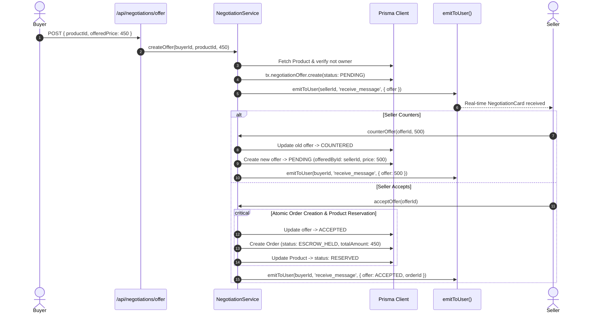
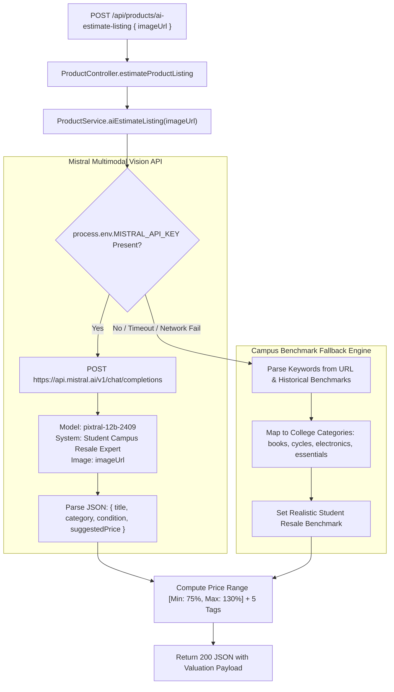
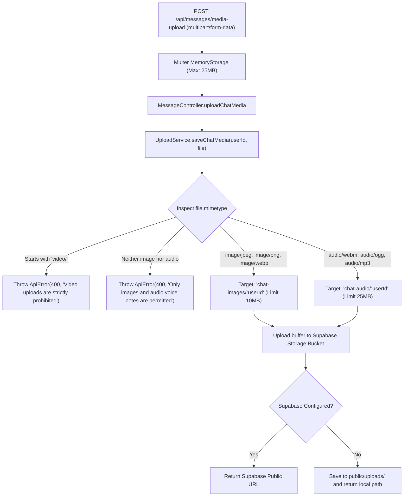
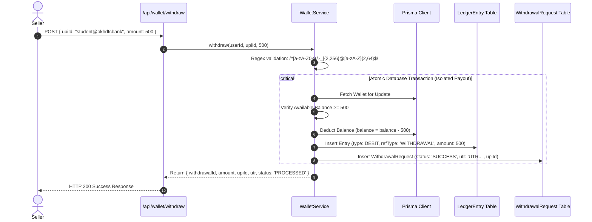
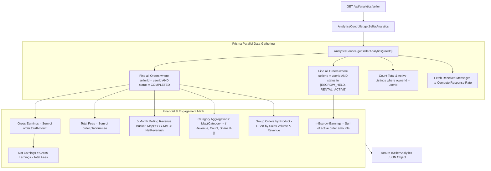

# College Marketplace — Backend Architecture & Service Specification

> **Runtime**: Node.js 20+ with TypeScript & Express  
> **ORM & Database**: Prisma ORM with PostgreSQL (Hosted on Supabase)  
> **Real-Time Layer**: Socket.IO Engine with Authenticated JWT Handshakes  
> **Payment & AI Integrations**: Razorpay Payments & Payouts, Mistral AI Pixtral Multimodal LLM  
> **Hosting & Storage**: Supabase Storage Buckets & Local Fallback Disk

---

## 1. High-Level Backend Architecture

The backend is built as a modular Express monolith adhering strictly to the **Controller-Service-Repository pattern**. Each domain module encapsulates its own routes, validation schemas, controllers, business services, and database repositories.



---

## 2. Comprehensive Directory Structure & Code Organization

```
Backend/
├── package.json                          # Dependencies, TypeScript build and script commands
├── tsconfig.json                         # TypeScript compiler configuration (strict mode)
├── .env.example                          # Environment variable template
├── prisma/
│   ├── schema.prisma                     # Prisma Schema (Models, Relations, Indexes, Enums)
│   └── migrations/                       # PostgreSQL migration history
│       ├── 20260412190427_inital_migration/
│       │   └── migration.sql             # Baseline tables and relationships
│       ├── 20260913120000_wallet_topup_webhook/
│       │   └── migration.sql             # Razorpay webhook idempotency & ledger schemas
│       └── migration_lock.toml           # Engine provider lock file
└── src/
    ├── index.ts                          # HTTP listener bootstrap & graceful shutdown
    ├── app.ts                            # Express app configuration & middleware pipeline
    ├── config/
    │   └── env.ts                        # Zod environment variable parsing & export
    ├── data/
    │   ├── campus-product-vectors.json   # Seed embeddings for campus product catalog RAG
    │   └── authentic-catalog/
    │       └── items.ts                  # Authentic campus fixtures & sample items
    ├── events/
    │   └── email-notification.listener.ts # Event listener for transactional email dispatches
    ├── lib/
    │   ├── prisma.ts                     # Prisma ORM singleton client instance
    │   ├── socket.ts                     # Socket.IO server, JWT authentication & room manager
    │   ├── supabase.ts                   # Supabase Storage client integration
    │   ├── email-queue.ts                # Asynchronous email queue with retry logic
    │   ├── events.ts                     # Application-wide EventEmitter instance
    │   └── scheduler.ts                  # Cron schedules (auction expiry, expired holds)
    ├── middlewares/
    │   ├── auth.middleware.ts            # JWT authentication & session attachment
    │   ├── error.middleware.ts           # Centralized ApiError handler & JSON response
    │   ├── notFound.middleware.ts        # 404 Route catch-all handler
    │   ├── requestLogger.middleware.ts   # UUID request tracing & latency logger
    │   └── validate.middleware.ts        # Zod request validation (body, query, params)
    ├── modules/
    │   ├── admin/                        # Superadmin moderation & financial controls
    │   │   ├── admin.controller.ts       # HTTP request handlers for admin operations
    │   │   ├── admin.repository.ts       # Admin queries & aggregation
    │   │   ├── admin.routes.ts           # Admin routes with superadmin guard
    │   │   ├── admin.schema.ts           # Zod schemas for admin actions
    │   │   ├── admin.service.ts          # Disputed orders resolution & platform revenue
    │   │   └── settings.service.ts       # Dynamic platform settings & fee configuration
    │   ├── analytics/                    # Campus seller analytics & insights
    │   │   ├── analytics.controller.ts   # HTTP handlers for seller KPI metrics
    │   │   ├── analytics.routes.ts       # Protected /api/analytics routes
    │   │   └── analytics.service.ts      # Revenue, category distribution & sales trends
    │   ├── assistant/                    # AI campus assistant & semantic catalog search
    │   │   ├── assistant.controller.ts   # Chatbot query handler
    │   │   ├── assistant.routes.ts       # /api/assistant routes
    │   │   ├── assistant.service.ts      # Mistral LLM context building & prompt engineering
    │   │   └── campus-vector.service.ts  # Vector cosine-similarity retrieval engine
    │   ├── auctions/                     # 24-hour move-out live auction engine
    │   │   ├── auction.controller.ts     # Auction creation, bidding, settlement handlers
    │   │   ├── auction.routes.ts         # /api/auctions routes
    │   │   ├── auction.schema.ts         # Zod schemas for bids and auction creation
    │   │   └── auction.service.ts        # Anti-sniping timer, bid escrow holds & settlement
    │   ├── auth/                         # Student authentication & identity verification
    │   │   ├── auth.controller.ts        # Login, registration, OTP verify handlers
    │   │   ├── auth.repository.ts        # User lookup and credential queries
    │   │   ├── auth.routes.ts            # Public and protected /api/auth routes
    │   │   ├── auth.schema.ts            # Zod validation schemas for registration & auth
    │   │   └── auth.service.ts           # Password hashing, JWT issuance & OTP emailing
    │   ├── messages/                     # Real-time chat & media messaging
    │   │   ├── message.controller.ts     # Thread fetching & message dispatch handlers
    │   │   ├── message.repository.ts     # Message persistence & unread counts
    │   │   ├── message.routes.ts         # /api/messages endpoints
    │   │   ├── message.schema.ts         # Zod schemas for text & media messages
    │   │   └── message.service.ts        # Chat storage & Socket.IO real-time emission
    │   ├── negotiations/                 # In-chat bargaining & counter-offer engine
    │   │   ├── negotiation.controller.ts # Offer creation, accept, decline, counter handlers
    │   │   ├── negotiation.routes.ts     # /api/negotiations routes
    │   │   └── negotiation.service.ts    # Offer state machine & atomic escrow order creation
    │   ├── orders/                       # Escrow purchase, rental & service orders
    │   │   ├── order.controller.ts       # Order lifecycle & OTP verification handlers
    │   │   ├── order.repository.ts       # Order queries, buyer/seller filters
    │   │   ├── order.routes.ts           # /api/orders endpoints
    │   │   ├── order.schema.ts           # Order validation schemas
    │   │   └── order.service.ts          # Escrow locks, OTP handshake & dispute handling
    │   ├── products/                     # Product catalog & AI visual listing engine
    │   │   ├── product.controller.ts     # Catalog CRUD & AI valuation handlers
    │   │   ├── product.repository.ts     # Filtered product queries & pagination
    │   │   ├── product.routes.ts         # /api/products endpoints
    │   │   ├── product.schema.ts         # Product validation (SELL, RENT, SERVICE, SUBSCRIPTION)
    │   │   └── product.service.ts        # Catalog management & Mistral Vision auto-fill
    │   ├── requests/                     # Campus item & service buyer requests
    │   │   ├── request.controller.ts     # Campus request CRUD handlers
    │   │   ├── request.repository.ts     # Request queries & campus filters
    │   │   ├── request.routes.ts         # /api/requests endpoints
    │   │   ├── request.schema.ts         # Request validation schemas
    │   │   └── request.service.ts        # Request posting & fulfillment matching
    │   ├── reviews/                      # Seller & service rating reviews
    │   │   ├── review.controller.ts      # Review submission & rating handlers
    │   │   ├── review.repository.ts      # Review queries & rating calculations
    │   │   ├── review.routes.ts          # /api/reviews endpoints
    │   │   ├── review.schema.ts          # Review submission schema
    │   │   └── review.service.ts         # Rating aggregation & review moderation
    │   ├── subscriptions/                # Recurring plans (Hostel meals, laundry, tiffin)
    │   │   ├── subscription.controller.ts# Subscribe, pause, resume, manifest handlers
    │   │   ├── subscription.repository.ts# Subscription delivery schedules
    │   │   ├── subscription.routes.ts    # /api/subscriptions endpoints
    │   │   ├── subscription.schema.ts    # Subscription schemas & vacation dates
    │   │   └── subscription.service.ts   # Upfront escrow hold, vacation pro-rata refund
    │   ├── upload/                       # Cloudinary/Supabase media pipeline
    │   │   ├── upload.controller.ts      # Upload handlers for images & audio voice notes
    │   │   ├── upload.routes.ts          # /api/upload routes with Multer middleware
    │   │   ├── upload.schema.ts          # Media upload request schemas
    │   │   └── upload.service.ts         # Supabase S3 storage & strict video MIME blocking
    │   ├── users/                        # Student profile management
    │   │   ├── user.controller.ts        # Profile details, avatar & settings handlers
    │   │   ├── user.repository.ts        # User record updates & profile queries
    │   │   ├── user.schema.ts            # Profile update schemas
    │   │   └── user.service.ts           # Student verification status & phone updates
    │   ├── wallet/                       # Double-entry ledger, internal balance & UPI payouts
    │   │   ├── wallet.controller.ts      # Topup, transfer, payout & ledger handlers
    │   │   ├── wallet.repository.ts      # Wallet balances & immutable ledger records
    │   │   ├── wallet.routes.ts          # /api/wallet endpoints
    │   │   ├── wallet.schema.ts          # Topup, payout & transfer validation
    │   │   └── wallet.service.ts         # Double-entry ledger integrity & Razorpay payouts
    │   └── wanted/                       # Campus "Wanted" bulletin board
    │       ├── wanted.controller.ts      # Wanted listing handlers
    │       ├── wanted.repository.ts      # Wanted item queries
    │       ├── wanted.routes.ts          # /api/wanted endpoints
    │       ├── wanted.schema.ts          # Wanted listing schemas
    │       └── wanted.service.ts         # Wanted bulletin matching
    ├── schemas/                          # Shared cross-domain schemas
    │   └── request.schema.ts             # Shared request validation primitives
    ├── scripts/                          # Diagnostic tools, seeders & integration test suites
    │   ├── check-embeddings-status.ts    # Vector embedding verification utility
    │   ├── make-admin.ts                 # CLI utility to elevate user to SUPERADMIN
    │   ├── seed-authentic-catalog.ts     # Authentic campus product seeder
    │   ├── test-admin-payouts-suite.ts   # Payout & admin moderation automated tests
    │   ├── test-auction-suite.ts         # Anti-sniping & live bidding automated tests
    │   ├── test-db-connection.ts         # PostgreSQL connection latency probe
    │   ├── test-enhancements-suite.ts    # Verification suite for all campus enhancements
    │   ├── test-marketplace-flow.ts      # Full E2E buy-rent-service cycle test
    │   ├── test-services-subscriptions.ts# Recurring subscription pro-rata test suite
    │   └── test-upload-pipeline.ts       # MIME filter & video rejection unit tests
    ├── templates/                        # Responsive HTML transactional email templates
    │   ├── auction-settled.template.ts   # Auction winning notification email
    │   ├── dispute-resolved.template.ts  # Escrow dispute resolution notification
    │   ├── order-receipt.template.ts     # Escrow order placement receipt
    │   ├── otp-email.template.ts         # 6-digit cryptographic OTP delivery email
    │   └── wallet-transfer.template.ts   # Internal wallet transfer receipt
    ├── types/                            # TypeScript ambient declarations & declaration merging
    │   ├── express.d.ts                  # Request context type augmentation (req.user)
    │   └── sib-api-v3-sdk.d.ts           # Brevo / Sendinblue SDK ambient types
    └── utils/                            # Shared utilities & error primitives
        ├── api-error.ts                  # Standardized ApiError with HTTP status codes
        ├── AppError.ts                   # Application error wrapper
        ├── asyncHandler.ts               # Express async route exception handler
        ├── generateOtp.ts                # Cryptographic 6-digit numeric OTP generator
        ├── response.ts                   # Standardized JSON response envelope formatter
        └── sendOtpEmail.ts               # Transactional email dispatcher via Brevo API
```

---

## 3. Detailed Backend Service Flows

### 3.1 Direct Negotiation State Machine & Atomic Escrow Order



---

### 3.2 Multimodal AI Listing Valuation Pipeline



---

### 3.3 Media Upload & Strict Video Filtering Engine



---

### 3.4 Real UPI Payout Engine & Double-Entry Ledger Invariants



---

### 3.5 Campus Seller Analytics Aggregator Engine



---

## 4. Database Schema & Prisma Entity Specifications

The backend uses **Prisma ORM** mapping onto PostgreSQL:

| Model | Purpose | Key Fields | Key Relations |
|---|---|---|---|
| `User` | Student Profile & Auth | `id`, `email`, `name`, `college`, `role` | `products`, `orders`, `wallet`, `offers` |
| `Product` | Campus Listings | `id`, `title`, `price`, `type`, `category`, `status` | `owner`, `orders`, `auction`, `offers` |
| `NegotiationOffer` | In-Chat Bargaining | `id`, `productId`, `buyerId`, `sellerId`, `offeredPrice`, `status` | `product`, `buyer`, `seller`, `order` |
| `Order` | Escrow Purchases & Gigs | `id`, `orderNumber`, `totalAmount`, `status`, `pickupOtp` | `buyer`, `seller`, `product`, `negotiation` |
| `Wallet` | Student Funds | `id`, `userId`, `balance`, `escrowBalance` | `user`, `ledgerEntries` |
| `LedgerEntry` | Double-Entry Audit Log | `id`, `walletId`, `amount`, `type`, `balanceBefore`, `balanceAfter` | `wallet` |
| `WithdrawalRequest` | UPI Payout Tracking | `id`, `userId`, `amount`, `upiId`, `status`, `utr` | `user` |
| `Subscription` | Hostel Meal Plans | `id`, `productId`, `frequency`, `status`, `vacationFrom` | `subscriber`, `provider`, `deliveries` |
| `Auction` | 24h Move-Out Auctions | `id`, `startingBid`, `highestBid`, `endsAt`, `antiSniping` | `product`, `bids` |

---

## 5. Security & Financial Invariants

1. **Double-Entry Balance Guarantee**: Direct modification of `wallet.balance` or `wallet.escrowBalance` outside of an atomic `prisma.$transaction` is prevented by design. Every balance adjustment is strictly accompanied by a corresponding `LedgerEntry` record.
2. **Strict Media Quarantine**: The `/api/messages/media-upload` route strictly inspects incoming MIME streams. If any MIME type matches `video/*`, the request is aborted with `400 Bad Request`.
3. **Cryptographic OTP Verification**: Order handovers require a 6-digit numeric OTP generated at checkout. The order only transitions from `ESCROW_HELD` to `COMPLETED` when the seller verifies the OTP against the database record.
